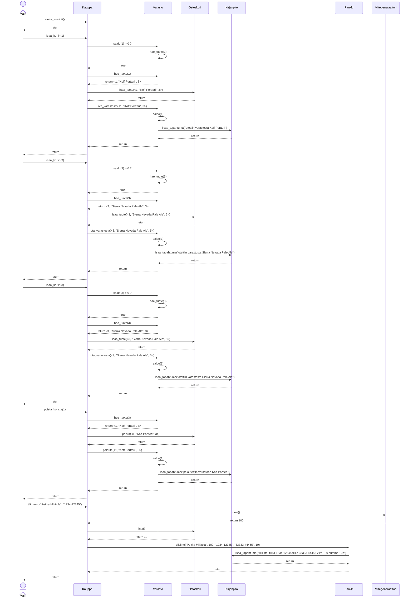

## Sequence diagram about index.py

```mermaid
sequenceDiagram
    actor Main
    participant Kauppa
    participant Varasto
    participant Ostoskori
    participant Kirjanpito
    participant Pankki
    participant Viitegeneraattori

    Main->>Kauppa: aloita_asiointi()
    Kauppa-->>Main: return

    Main->>Kauppa: lisaa_koriin(1)
    Kauppa->>Varasto: saldo(1) > 0 ?
    Varasto->>Varasto: hae_tuote(1)
    Varasto-->>Kauppa: true
    Kauppa->>Varasto: hae_tuote(1)
    Varasto-->>Kauppa: return <1, "Koff Portteri", 3>
    Kauppa->>Ostoskori: lisaa_tuote(<1, "Koff Portteri", 3>)
    Ostoskori-->>Kauppa: return
    Kauppa->>Varasto: ota_varastosta(<1, "Koff Portteri", 3>)
    Varasto->>Varasto: saldo(1)
    Varasto->>Kirjanpito: lisaa_tapahtuma("otettiin varastosta Koff Portteri")
    Kirjanpito-->>Varasto: return
    Varasto-->>Kauppa: return
    Kauppa-->>Main: return

    Main->>Kauppa: lisaa_koriin(3)
    Kauppa->>Varasto: saldo(3) > 0 ?
    Varasto->>Varasto: hae_tuote(3)
    Varasto-->>Kauppa: true
    Kauppa->>Varasto: hae_tuote(3)
    Varasto-->>Kauppa: return <1, "Sierra Nevada Pale Ale", 3>
    Kauppa->>Ostoskori: lisaa_tuote(<3, "Sierra Nevada Pale Ale", 5>)
    Ostoskori-->>Kauppa: return
    Kauppa->>Varasto: ota_varastosta(<3, "Sierra Nevada Pale Ale", 5>)
    Varasto->>Varasto: saldo(3)
    Varasto->>Kirjanpito: lisaa_tapahtuma("otettiin varastosta Sierra Nevada Pale Ale")
    Kirjanpito-->>Varasto: return
    Varasto-->>Kauppa: return
    Kauppa-->>Main: return

    Main->>Kauppa: lisaa_koriin(3)
    Kauppa->>Varasto: saldo(3) > 0 ?
    Varasto->>Varasto: hae_tuote(3)
    Varasto-->>Kauppa: true
    Kauppa->>Varasto: hae_tuote(3)
    Varasto-->>Kauppa: return <1, "Sierra Nevada Pale Ale", 3>
    Kauppa->>Ostoskori: lisaa_tuote(<3, "Sierra Nevada Pale Ale", 5>)
    Ostoskori-->>Kauppa: return
    Kauppa->>Varasto: ota_varastosta(<3, "Sierra Nevada Pale Ale", 5>)
    Varasto->>Varasto: saldo(3)
    Varasto->>Kirjanpito: lisaa_tapahtuma("otettiin varastosta Sierra Nevada Pale Ale")
    Kirjanpito-->>Varasto: return
    Varasto-->>Kauppa: return
    Kauppa-->>Main: return

    Main->>Kauppa: poista_korista(1)
    Kauppa->>Varasto: hae_tuote(3)
    Varasto-->>Kauppa: return <1, "Koff Portteri", 3>
    Kauppa->>Ostoskori: poista(<1, "Koff Portteri", 3>)
    Ostoskori-->>Kauppa: return
    Kauppa->>Varasto: palauta(<1, "Koff Portteri", 3>)
    Varasto->>Varasto: saldo(1)
    Varasto->>Kirjanpito: lisaa_tapahtuma("palautettiin varastoon Koff Portteri")
    Kirjanpito-->>Varasto: return
    Varasto-->>Kauppa: return
    Kauppa-->>Main: return

    Main->>Kauppa: tilimaksu("Pekka Mikkola", "1234-12345")
    Kauppa->>Viitegeneraattori: uusi()
    Viitegeneraattori-->>Kauppa: return 100
    Kauppa->>Ostoskori: hinta()
    Ostoskori-->>Kauppa: return 10
    Kauppa->>Pankki: tilisiirto("Pekka Mikkola", 100, "1234-12345", "33333-44455", 10)
    Pankki->>Kirjanpito: lisaa_tapahtuma("tilisiirto: tililtä 1234-12345 tilille 33333-44455 viite 100 summa 10e")
    Kirjanpito-->>Pankki: return
    Pankki-->>Kauppa: return
    Kauppa-->>Main: return
```